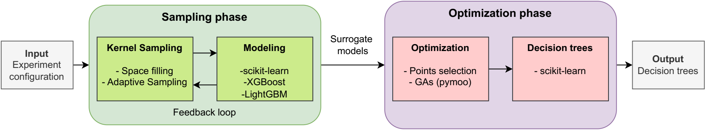

# MLKAPS


[](https://opensource.org/licenses/BSD-3-Clause)

MLKAPS (Machine Learning for Kernel Accuracy and Performance Studies) is a black-box machine learning auto-tuning tool predicting best design parameters of a computational kernel for any given input configuration.

It was succesfully used to tune software arithmetic, numerical kernels, as well as hardware arithmetic unit design, and competitive analysis.

MLKAPS is an open source tool, if you wish to contribute please read the [Contributor's guidelines](CONTRIBUTING.md).

## Index

- [MLKAPS](#mlkaps)
  - [Index](#index)
  - [Description](#description)
  - [Installation](#installation)
  - [Usage](#usage)
    - [Creating a configuration file](#creating-a-configuration-file)
    - [Launching an experiment](#launching-an-experiment)
  - [Citing this work](#citing-this-work)
  - [Licence and copyright](#licence-and-copyright)
 
## Description

Configuring applications to achieve maximum performance, accuracy, or minimum energy consumption is a difficult task. It is often achieved via hand-tuning, which is subject to bias and blind-spots. MLKAPS attempts to solve this issue using auto-tuning techniques that leverages Machine Learning (ML).

MLKAPS is conceived to generate decision trees that give the best configuration to an input problem.




This workflow represents MLKAPS pipeline. Given a kernel taking a set of input parameters `I` (matrix size, length of input vector, ...) and a set of design parameters `D` (number of threads, number of nodes, block size, tiling...), MLKAPS will build decision trees that provide the best configuration trade-off for any input.

The main steps of the pipeline for software kernel optimization are:

1. **Input configuration**: the user provides a JSON configuration files describing the application to tune, including the input and design parameters.
2. **Sampling**: MLKAPS samples the parameters space using a variety of sampling algorithm, including adaptive sampling.
4. **Surrogate modeling**: MLKAPS builds a regression model capable of cost-effectively predict the different objectives described in the configuration.
5. **Optimizing**: MLKAPS builds a grid on the input space, and find the optimal configuration for each point of the grid.
6. **Building decision tree**: MLKAPS generate decision trees of given depth that are fitted on the optimization grid.
7. **(Experimental) Generating code**: the decision trees are exported to C code to be used in user application.

MLKAPS is quite versatile, and can be repurposed for similar optimization problems. On-going work will improve the interface and provide more pre-defined features and workflow.

## Installation

MLKAPS can be installed using `pip`. We recommend using `virtualenv` to create a clean environment for the installation.
Run the following command at the root of the MLKAPS sources:

```bash
python3 -m venv venv      # Create a virtual environment     (optional)
source venv/bin/activate  # Activate the virtual environment (optional)
pip install .             # Install MLKAPS
```

`mlkaps` should now be installed and added to your `PATH`, which you can test with:
```bash
mlkaps --help
```

To verify that the install was succesfull you can run the test-suite:

```bash
pytest ./tests
```

## Usage

In order to run, MLKAPS needs two inputs:

1. A benchmark/application executable. The input parameters will be given by MLKAPS sampler as argument to the script in the order defined in the configuration file. The output objectives (execution time, energy consumption, numerical accuracy) should be printed as a comma-separated list, in the last line of the executable output. We recommend wrapping the target in bash script if needed. **Ensure that this executable exits with -1 on failure.**
2. A configuration describing the experiments

### Creating a configuration file

For configuration description see [JSON configuration documentation](doc/json_conf.md). Ensure the parameters range and ordering is coherent between the configuration file and your executable.

Furture work is considering python interface to handle experiement definition, escaping the error prone process of carefuly writing list in json using matching ordering. (Issue #13)

### Launching an experiment

When your executable and configuration file are ready, you can run MLKAPS by using:

```bash
mlkaps <config.json> 
```

**We highly recommend:**

* using `tmux` or `screen` to prevent your experiment stopping if you lose connection to your tuning environment. Full checkpoint resart is being tested and should be release soon. 
* validate your setup by running a simplified version of your kernel/configuration.

## Citing this work

If you use MLKAPS in your research, please cite the following paper:

* [**MLKAPS: Machine Learning and Adaptive Sampling for HPC Kernel Auto-tuning**](https://arxiv.org/abs/2501.05811) <br> Mathys Jam (LI-PaRAD, UVSQ), Eric Petit (intel), Pablo de Oliveira Castro (LI-PaRAD, UVSQ), David Defour (LAMPS, UPVD), Greg Henry, William Jalby (LI-PaRAD, UVSQ)

## Licence and copyright

* Copyright (C) 2020-2024 Intel Corporation
* Copyright (C) 2022-2024 University of Versailles Saint-Quentin-en-Yvelines
* Copyright (C) 2024-  MLKAPS contributors
* SPDX-License-Identifier: BSD-3-Clause
